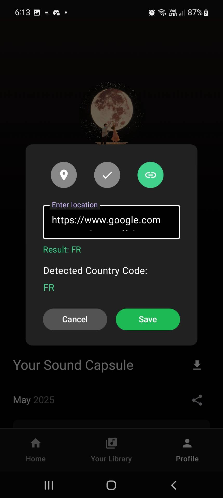
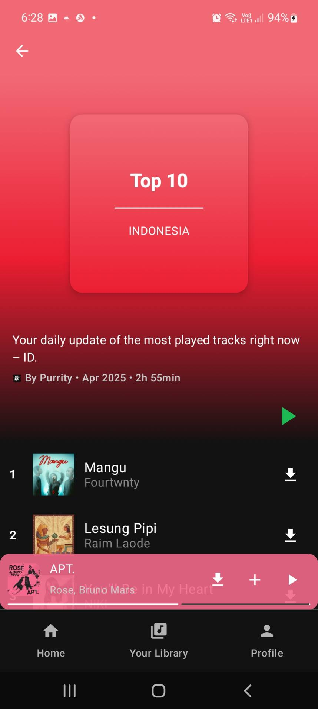

  

  <h1 style="color: #008080;font-size: 40px;font-weight: bold;">Aplikasi Purrytify</h1>

Aplikasi Purrytify adalah platform streaming musik yang memudahkan pengguna untuk menambah dan menikmati lagu secara interaktif. Dengan fitur unggulan seperti penambahan lagu ke dalam koleksi pribadi, streaming berkualitas tinggi, serta kontrol pemutaran seperti mode "next" dan daftar putar yang dapat dikustomisasi, aplikasi ini didesain untuk memberikan pengalaman mendengarkan musik yang seru dan praktis. Antarmuka yang intuitif serta desain modern mendukung kemudahan navigasi dan penggunaan setiap harinya.

# Table of Contents
- [Library yang Digunakan](#library-yang-digunakan)
- [Screenshot Aplikasi](#screenshot-aplikasi)
- [Pembagian Kerja Anggota Kelompok](#pembagian-kerja-anggota-kelompok)
- [Jumlah Jam Persiapan dan Pengerjaan](#jumlah-jam-persiapan-dan-pengerjaan)
- [Penanganan dan Analisis OWASP](#penanganan-dan-analisis-owasp)
- [Aksesibilitas Testing](#aksesibilitas-testing)

---

# Library yang Digunakan

- androidx-core-ktx: 1.12.0
- androidx-core-splashscreen: 1.0.1
- androidx-datastore-preferences: 1.1.3
- androidx-hilt-hilt-navigation-compose: 1.2.0
- androidx-hilt-work: 1.2.0
- androidx-material-icons-extended: 1.7.8
- androidx-material3-window-size: 1.1.0
- androidx-navigation-navigation-compose: 2.8.9
- androidx-palette: 1.0.0
- androidx-recyclerview: 1.3.1
- androidx-room-compiler: 2.6.1
- androidx-room-ktx: 2.6.1
- androidx-room-runtime: 2.6.1
- androidx-runtime-livedata: 1.7.8
- androidx-work-runtime-ktx: 2.8.1
- coil-compose: 2.7.0
- compiler: 4.16.0
- converter-gson: 2.11.0
- glide: 4.16.0
- hilt-android: 2.51.1
- hilt-android-compiler: 2.51.1
- junit: 4.13.2
- androidx-junit: 1.2.1
- androidx-espresso-core: 3.6.1
- androidx-lifecycle-runtime-ktx: 2.8.7
- androidx-activity-compose: 1.8.2
- androidx-compose-bom: 2025.03.00
- androidx-ui: (latest)z
- androidx-ui-tooling: (latest)
- androidx-ui-tooling-preview: (latest)
- androidx-ui-test-manifest: (latest)
- androidx-ui-test-junit4: (latest)
- androidx-material3: 1.3.1
- logging-interceptor: 4.12.0
- retrofit: 2.11.0
- tink-android: 1.17.0
- androidx-material3-window-size-class1-android: 1.3.2

- **Kotlin** – Bahasa pemrograman utama untuk Android.
- **Jetpack Compose** – Untuk UI modern dengan deklaratif.
- **Hilt** – Dependency injection.
- **Room** – Untuk manajemen database.
- **Retrofit** – Untuk komunikasi API.
- (Tambahkan library lainnya sesuai kebutuhan)

---

# Screenshot Aplikasi
## Login

## Home

## Library

## Profile  

## Add Song

## Full Player  

## Top Songs and Recommendation

## Edit Song

## Like Song 

## Queue

## Offline

## Back Online

--- 

# Pembagian Kerja Anggota Kelompok

## Milestone 1
| No | Bagian/Fitur            | Anggota (PIC) | 
|----|-------------------------|---------------|
| 1  | Header dan Navbar       | 13522117      | 
| 2  | Login                   | 13522117      | 
| 3  | Home                    | 13522077      |  
| 4  | Library                 | 13522117      | 
| 5  | Pemutaran Lagu          | 13522019   | 
| 6  | Penambahan Lagu         | 13522117      |
| 7  | Profile                 | 13522019     |  
| 8  | Liked Songs             | 13522117      | 
| 9  | Background Service      | 13522117      | 
| 10 | Network Sensing         | 13522077     | 
| 11 | Queue                   | 13522077    | 
| 12 | Shuffle                 | 13522077     |
| 13 | Repeat                  | 13522077    | 
| 14 | OWASP                   |13522019     |
| 15 | Pencarian               | 13522117     | 
| 16 | Accessibility Testing   | 13522019    | 

## Milestone 2
| No | Bagian/Fitur                                              | Anggota (PIC)  |
| -- | --------------------------------------------------------- | ---------------|
| 1  | Online Songs                                              | 13522117       |
| 2  | Download Online Songs                                     | 13522117       |
| 3  | Sound Capsule (Analytics) & Export                        | 13522077       |
| 4  | Notification Controls                                     | 13522117       |
| 5  | Audio Routing and Output Device                           | 13522077       |
| 6  | Share Songs via URL                                       | 13522019       |
| 7  | Share Songs via QR                                        | 13522019       |
| 8  | Halaman Responsive                                        | Seluruh Anggota|
| 9  | Edit Profile                                              | 13522019       |
| 10 | Rekomendasi Lagu                                          | 13522077       |
| 11 | Share Sound Capsule                                       | 13522077       |
| 12 | Add Server Songs to Recently Played/Liked & Sound Capsule | 13522117       |
| 13 | Caching                                                   | 13522077       |
| 14 | OWASP                                                     | 13522019       |
| 15 | Accessibility Testing                                     | 13522019       |

---

# Jumlah Jam Persiapan dan Pengerjaan

| Nama           | Persiapan | Pengerjaan | Total Jam |
|----------------|-----------|------------|-----------|
| 13522019     | 40 Jam     | 32 Jam     | 72 Jam    |
| 13522077      |  40 Jam     | 32 Jam     | 72 Jam    |
| 13522117      | 40 Jam     | 48 Jam     | 88 Jam    |

---

# Penanganan dan Analisis OWASP

**OWASP Top 10 Mobile** adalah daftar sepuluh kerentanan keamanan yang paling umum ditemukan pada aplikasi mobile. Daftar ini diterbitkan oleh Open Web Application Security Project (OWASP), organisasi nirlaba yang berfokus pada peningkatan keamanan perangkat lunak. Tujuan utama dari OWASP Top 10 Mobile adalah untuk meningkatkan kesadaran pengembang akan ancaman keamanan dan mendorong penerapan langkah-langkah mitigasi guna mengurangi risiko pada aplikasi mobile.

Dalam eksperimen pengujian ini, kami melakukan analisis keamanan terhadap aplikasi berdasarkan tiga kerentanan utama dari daftar 2024, yaitu:

- **M4: Insufficient Input/Output Validation**
- **M8: Security Misconfiguration**
- **M9: Insecure Data Storage**

---

## M4: Insufficient Input/Output Validation

**Deskripsi:**  
M4 terjadi ketika aplikasi tidak melakukan validasi dan sanitasi input pengguna maupun output data dengan benar. Hal ini dapat membuka celah bagi serangan seperti SQL injection, Cross-Site Scripting (XSS), dan manipulasi data lainnya. Secara umum, validasi dilakukan pada bagian server, namun dalam implementasi kali ini, kami sebisa mungkin mengimplementasikan pada sisi client.

### Implementasi Milestone 1
- **Validasi Input:**  
  - Menggunakan validasi format (misalnya, regex untuk email) pada semua input pengguna dan memastikan data tidak kosong dan memenuhi standar yang telah ditetapkan (contoh: memeriksa apakah input berupa email atau password sudah terisi dengan benar).
  
- **Penggunaan Parameterized Queries**  
  - Menerapkan parameter binding atau prepared statements pada query database untuk mencegah SQL injection. Implementasi di Client-Side mencakup implementasi saat melaksanakan Room Query seperti gambar dibawah
  

### Implementasi Milestone 2
- **Validasi Output:**  
  Menggunakan validasi format output agar tidak ada data yang tersimpan dalam database dengan format yang salah. Dalam kasus dibawah, dilakukan validasi agar penyimpanan pada server akan aman , dimana dalam kondisi ini diasumsikan harus selalu bernilai 2 alfabet kapital.
  
  
  
---

### M8: Security Misconfiguration

**Deskripsi:**  
M8 berhubungan dengan kesalahan konfigurasi sistem, baik pada server, aplikasi, maupun library yang digunakan. Konfigurasi yang tidak optimal atau masih menggunakan pengaturan default dapat membuat aplikasi rentan terhadap serangan.

### Implementasi Milestone 1
- **Perbaikan Konfigurasi:**  
Konfigurasi buildTypes di dalam file build.gradle ini sesuai dengan M8 karena mengatur proses build aplikasi Android pada versi rilis (release), yang penting untuk memastikan aplikasi yang diproduksi siap untuk distribusi. Pengaturan isDebuggable = false mencegah proses debug pada aplikasi rilis, menjaga keamanan aplikasi. Sementara itu, isMinifyEnabled = true mengaktifkan minifikasi menggunakan ProGuard atau R8, yang mengurangi ukuran file aplikasi dan mengobfuskasi kode agar lebih sulit dibongkar.
  

### Implementasi Milestone 2
- **Deklarasi perizinan sesuai kebutuhan:**  
  Memastikan bahwa hanya izin (permission) yang benar-benar dibutuhkan saja yang dideklarasikan dalam AndroidManifest.xml. Dengan membatasi perizinan secara tepat, aplikasi mengurangi permukaan serangan dan melindungi privasi pengguna dari akses yang tidak sah.
  
- **Memastikan penggunaan dan menangani kasus perizinan tertolak**  
  Memastikan bahwa menyediakan kasus dimana perizinan ditolak pengguna , sehingga aplikasi yang dibuat tidak mengalami random crash atau force close

  
---

### M9: Insecure Data Storage

**Deskripsi:**  
M9 menyangkut penyimpanan data yang tidak aman, di mana data sensitif dapat diakses atau dicuri oleh pihak tidak berwenang. Ini sangat penting pada aplikasi mobile, di mana penyimpanan lokal atau penggunaan cloud harus dilakukan dengan tingkat keamanan tinggi.

### Implementasi Milestone 1
- **Enkripsi Data:**  
***Implementasi Kelas Enkripsi***

    - ***Implementasi Kelas Enkripsi***  
      
      
      
    - ***Implementasi Enkripsi pada penyimpanan token***  
      
      
      
    - ***Implementasi Dekripsi saat mengambil refresh token***
      

- **Penggunaan Penyimpanan Aman:**  
Aplikasi kami aman karena menggunakan Google Tink dan Android KeyStore untuk menyimpan data sensitif secara terenkripsi. Master key yang dilindungi hardware-backed memastikan kunci tidak dapat diakses, sementara keyset enkripsi disimpan di SharedPreference dalam bentuk terenkripsi, sehingga data seperti token tidak tersimpan sebagai plain text.

    - ***Implementasi Shared Preference dalam penyimpanan keyset enkripsi***

- **Pengaturan Izin Akses:**  
  - Membatasi akses ke data lokal dengan menetapkan izin yang tepat sehingga data tidak dapat diakses oleh aplikasi lain. Penggunaan penyimpanan internal seperti DataStore merupakan langkah yang sesuai dengan pendekatan OWASP M9, karena data hanya dapat diakses oleh aplikasi tersebut. 
      - ***Implementasi Penyimpanan token di Context***  
      
      

### Implementasi Milestone 2
- **Enkripsi Data (Versi 2):**  
Disini dilakukan enkripsi tambahan pada preferences, untuk proses caching
      
---

Dokumentasi ini mencerminkan upaya kami untuk mengatasi dan memitigasi risiko dari tiga kerentanan utama tersebut. Dengan menerapkan langkah-langkah di atas, kami berusaha mewujudkan aplikasi mobile yang aman, andal, dan sesuai dengan standar keamanan dari OWASP.

## Aksesibilitas Testing
 
Perubahan yang dilakukan:
- Memberikan content description yang berbeda untuk foto album serta judul lagu pada full player.
- Memberikan content description pada text dalam sebuah view dengan menggunakan mergeDescendants sehingga dianggap menjadi sebuah node
- Mengubah kontras warna pada tombol login serta tombol play
- Memberikan content description yang berbeda untuk tombol penambahan pada tiap komponen yang muncul dalam 1 halaman yang sama
- Meningkatkan aksesibilitas dengan memperbesar icon

Perubahan yang tidak / tidak dapat dilakukan:
- Adanya hidden text pada background login , dimana sistem melihat tulisan pada background sebagai text
- Content Description yang sama pada recycleview dimana keduanya muncul pada 1 halaman yang sama, namun dianggap minor karena jika dikonversi pada text, keduanya sebenarnya memiliki definisi yang sama serta fungsi yang sama , yakni untuk memutar lagu
- Kontras warna pada beberapa background album dengan background aplikasi. Hal ini dianggap minor karena tidak semua album , melainkan hanya album tertentu yang tidak memiliki kontras yang baik dengan background aplikasi.

NB : Karena merasa UI lebih penting, kami akhirnya memilih untuk tidak memperbesar icon

Masalah pada milestone 2:
1. Kontras warna antara teks dan background terlalu rendah sehingga memicu error tes aksesibilitas , namun pada implementasi kali ini tidak dilakukan perbaikan , karena hal ini tergantung denagn lagu serta background yang dibuat.
2. Multiple item with the same description , dimana seperti untuk lagu  yang di download kebanyakan lagu akan memiliki tag yang sama.
---

