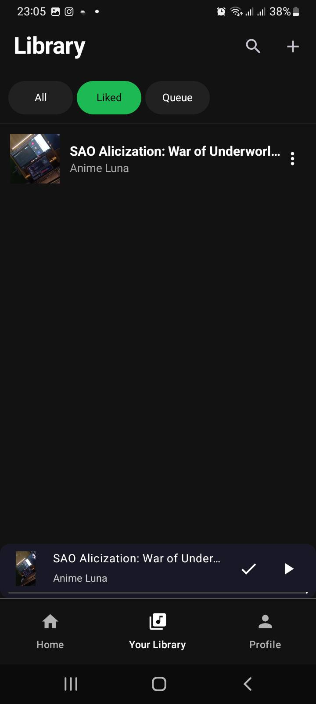

  

  <h1 style="color: #008080;font-size: 40px;font-weight: bold;">Aplikasi Purrytify</h1>

Aplikasi Purrytify adalah platform streaming musik yang memudahkan pengguna untuk menambah dan menikmati lagu secara interaktif. Dengan fitur unggulan seperti penambahan lagu ke dalam koleksi pribadi, streaming berkualitas tinggi, serta kontrol pemutaran seperti mode "next" dan daftar putar yang dapat dikustomisasi, aplikasi ini didesain untuk memberikan pengalaman mendengarkan musik yang seru dan praktis. Antarmuka yang intuitif serta desain modern mendukung kemudahan navigasi dan penggunaan setiap harinya.

## Table of Contents
- [Library yang Digunakan](#library-yang-digunakan)
- [Screenshot Aplikasi](#screenshot-aplikasi)
- [Pembagian Kerja Anggota Kelompok](#pembagian-kerja-anggota-kelompok)
- [Jumlah Jam Persiapan dan Pengerjaan](#jumlah-jam-persiapan-dan-pengerjaan)
- [Penanganan dan Analisis OWASP](#penanganan-dan-analisis-owasp)
- [Aksesibilitas Testing](#aksesibilitas-testing)

---

## Library yang Digunakan

Masukin lagi nanti diakhir:

- **Kotlin** – Bahasa pemrograman utama untuk Android.
- **Jetpack Compose** – Untuk UI modern dengan deklaratif.
- **Hilt** – Dependency injection.
- **Room** – Untuk manajemen database.
- **Retrofit** – Untuk komunikasi API.
- (Tambahkan library lainnya sesuai kebutuhan)

---

## Screenshot Aplikasi
**Login**  

**Home**  

**Lbrary**  

**Profile**  

**Add Song**  

**FullPlayer**  

**Edit Song**  

**LikedSong**  

**No Network**  

**Online again**  

--- 

## Pembagian Kerja Anggota Kelompok

| No | Bagian/Fitur            | Anggota (PIC) | 
|----|-------------------------|---------------|
| 1  | Header dan Navbar       | 13522117      | 
| 2  | Login                   | 13522117      | 
| 3  | Home                    | 13522077      |  
| 4  | Library                 | 13522117      | 
| 5  | Pemutaran Lagu          | 13522019   | 
| 6  | Penambahan Lagu         | 13522117      |
| 7  | Profile                 | 13522019     |  
| 8  | Liked Songs             | 13522117      | 
| 9  | Background Service      | 13522117      | 
| 10 | Network Sensing         | 13522077     | 
| 11 | Queue                   | 13522077    | 
| 12 | Shuffle                 | 13522077     |
| 13 | Repeat                  | 13522077    | 
| 14 | OWASP                   |13522019     |
| 15 | Pencarian               | 13522117     | 
| 16 | Accessibility Testing   | 13522019    | 

---

## Jumlah Jam Persiapan dan Pengerjaan

Cantumkan jumlah jam yang dihabiskan untuk persiapan, pengembangan, dan pengerjaan secara keseluruhan untuk masing-masing anggota. Contoh:

| Nama           | Persiapan | Pengerjaan | Total Jam |
|----------------|-----------|------------|-----------|
| 13522019     | 40 Jam     | 32 Jam     | 72 Jam    |
| 13522077      |  40 Jam     | 32 Jam     | 72 Jam    |
| 13522117      | 40 Jam     | 48 Jam     | 88 Jam    |

---

## Penanganan dan Analisis OWASP

**OWASP Top 10 Mobile** adalah daftar sepuluh kerentanan keamanan yang paling umum ditemukan pada aplikasi mobile. Daftar ini diterbitkan oleh Open Web Application Security Project (OWASP), organisasi nirlaba yang berfokus pada peningkatan keamanan perangkat lunak. Tujuan utama dari OWASP Top 10 Mobile adalah untuk meningkatkan kesadaran pengembang akan ancaman keamanan dan mendorong penerapan langkah-langkah mitigasi guna mengurangi risiko pada aplikasi mobile.

Dalam eksperimen pengujian ini, kami melakukan analisis keamanan terhadap aplikasi berdasarkan tiga kerentanan utama dari daftar 2024, yaitu:

- **M4: Insufficient Input/Output Validation**
- **M8: Security Misconfiguration**
- **M9: Insecure Data Storage**

---

### M4: Insufficient Input/Output Validation

**Deskripsi:**  
M4 terjadi ketika aplikasi tidak melakukan validasi dan sanitasi input pengguna maupun output data dengan benar. Hal ini dapat membuka celah bagi serangan seperti SQL injection, Cross-Site Scripting (XSS), dan manipulasi data lainnya. Secara umum, validasi dilakukan pada bagian server, namun dalam implementasi kali ini, kami sebiasa mungkin mengimplementasikan pada sisi client.

**Langkah Penanganan:**  
- **Validasi Input:**  
  - Menggunakan validasi format (misalnya, regex untuk email) pada semua input pengguna dan memastikan data tidak kosong dan memenuhi standar yang telah ditetapkan (contoh: memeriksa apakah input berupa email atau password sudah terisi dengan benar).
  
- **Penggunaan Parameterized Queries**  
  - Menerapkan parameter binding atau prepared statements pada query database untuk mencegah SQL injection. Implementasi di Client-Side mencakup implementasi saat melaksanakan Room Query seperti gambar dibawah
  

---

### M8: Security Misconfiguration

**Deskripsi:**  
M8 berhubungan dengan kesalahan konfigurasi sistem, baik pada server, aplikasi, maupun library yang digunakan. Konfigurasi yang tidak optimal atau masih menggunakan pengaturan default dapat membuat aplikasi rentan terhadap serangan.

**Langkah Penanganan:**  
- **Perbaikan Konfigurasi:**  
  - Mengubah konfigurasi default pada server dan aplikasi guna menghindari setting yang rentan.
  - Mengamankan file konfigurasi dan mengatur hak akses yang tepat untuk mencegah akses tidak sah.
- **Konektivitas Aman:**  
  - Memastikan semua komunikasi menggunakan protokol terenkripsi (misalnya, HTTPS).
- **Audit dan Pemantauan:**  
  - Melakukan audit konfigurasi secara berkala untuk mendeteksi perubahan yang tidak diinginkan.
  - Mengimplementasikan alat pemantauan untuk memeriksa potensi kesalahan konfigurasi secara real-time.

---

### M9: Insecure Data Storage

**Deskripsi:**  
M9 menyangkut penyimpanan data yang tidak aman, di mana data sensitif dapat diakses atau dicuri oleh pihak tidak berwenang. Ini sangat penting pada aplikasi mobile, di mana penyimpanan lokal atau penggunaan cloud harus dilakukan dengan tingkat keamanan tinggi.

**Langkah Penanganan:**  
- **Enkripsi Data:**  
***Implementasi Kelas Enkripsi***

    - ***Implementasi Kelas Enkripsi***  
      
      
      
    - ***Implementasi Enkripsi pada penyimpanan token***  
      
      
      
    - ***Implementasi Dekripsi saat mengambil refresh token***
      

- **Penggunaan Penyimpanan Aman:**  
Aplikasi kami aman karena menggunakan Google Tink dan Android KeyStore untuk menyimpan data sensitif secara terenkripsi. Master key yang dilindungi hardware-backed memastikan kunci tidak dapat diakses, sementara keyset enkripsi disimpan di SharedPreference dalam bentuk terenkripsi, sehingga data seperti token tidak tersimpan sebagai plain text.

    - ***Implementasi Shared Preference dalam penyimpanan keyset enkripsi***

- **Pengaturan Izin Akses:**  
  - Membatasi akses ke data lokal dengan menetapkan izin yang tepat sehingga data tidak dapat diakses oleh aplikasi lain. Penggunaan penyimpanan internal seperti DataStore merupakan langkah yang sesuai dengan pendekatan OWASP M9, karena data hanya dapat diakses oleh aplikasi tersebut. 
      - ***Implementasi Penyimpanan token di Context***  
      
      

---

Dokumentasi ini mencerminkan upaya kami untuk mengatasi dan memitigasi risiko dari tiga kerentanan utama tersebut. Dengan menerapkan langkah-langkah di atas, kami berusaha mewujudkan aplikasi mobile yang aman, andal, dan sesuai dengan standar keamanan dari OWASP.

## Aksesibilitas Testing

Hasil testing dapat dilihat pada link berikut : https://drive.google.com/file/d/14YwVKkxjG2GD0K88KJaBYnUVgNcGpOG_/view?usp=sharing
 
Perubahan yang dilakukan:
- Memberikan content description yang berbeda untuk foto album serta judul lagu pada full player.
- Memberikan content description pada text dalam sebuah view dengan menggunakan mergeDescendants sehingga dianggap menjadi sebuah node
- Mengubah kontras warna pada tombol login serta tombol play
- Memberikan content description yang berbeda untuk tombol penambahan pada tiap komponen yang muncul dalam 1 halaman yang sama
- Meningkatkan aksesibilitas dengan memperbesar icon

Perubahan yang tidak / tidak dapat dilakukan:
- Adanya hidden text pada background login , dimana sistem melihat tulisan pada background sebagai text
- Content Description yang sama pada recycleview dimana keduanya muncul pada 1 halaman yang sama, namun dianggap minor karena jika dikonversi pada text, keduanya sebenarnya memiliki definisi yang sama serta fungsi yang sama , yakni untuk memutar lagu
- Kontras warna pada beberapa background album dengan background aplikasi. Hal ini dianggap minor karena tidak semua album , melainkan hanya album tertentu yang tidak memiliki kontras yang baik dengan background aplikasi.

---

